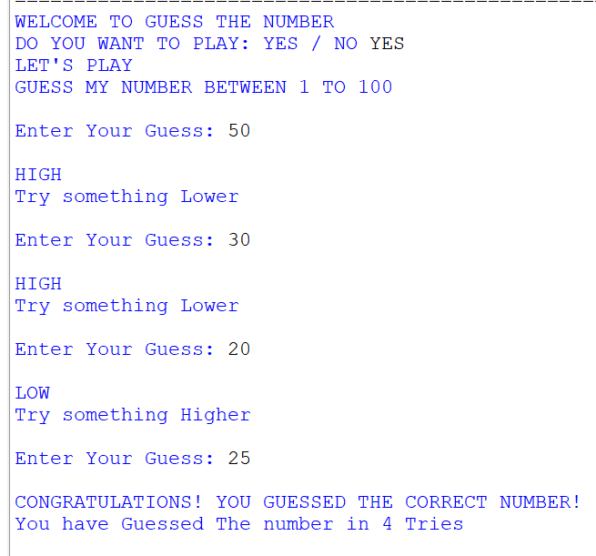

# 🎯 Guess The Number – Python Game

## 📌 Project Overview

Guess The Number is a console-based Python game where the computer generates a random number between **1 and 100**. The player tries to guess the number with the help of **HIGH** and **LOW** hints.

The program also counts the number of attempts taken to guess the correct number.

## 🎯 Objectives

- Practice basic Python programming concepts.
- Understand random number generation.
- Work with user input and conditions.
- Use loops and functions to build an interactive program.
- Improve logical thinking and problem-solving skills.

## ✨ Features

- 🎲 Generates a random number from 1 to 100
- 🎮 Interactive user input
- 🔺 HIGH / 🔻 LOW hints
- 🔢 Counts the number of attempts
- 🎉 Displays a successful guess message
- 🔄 Allows the game to restart

## 🛠️ Technologies Used

- **Python**
- **Random Module**
- **VS Code / Python IDLE**

## 🧠 Python Concepts Used

- Functions
- Variables
- Conditional Statements (`if`, `elif`, `else`)
- `while` Loop
- User Input
- Random Number Generation
- String Method (`lower()`)
- Counter

## ⚙️ How It Works

1. The program asks the player whether they want to play.
2. A random number between 1 and 100 is generated.
3. The player enters a guess.
4. The program gives a **HIGH** or **LOW** hint.
5. The player continues guessing until the correct number is found.
6. The program displays the number of attempts taken.

## 💻 Main Code

```python
import random as r

def GuessNo():
    count = 0
    print("WELCOME TO GUESS THE NUMBER")

    p = input("DO YOU WANT TO PLAY: YES / NO ")

    if p.lower() == "yes":
        print("LET'S PLAY")

        num = r.randint(1, 100)
        print("GUESS MY NUMBER BETWEEN 1 TO 100")
        print()

        while True:
            count = count + 1
            guess = int(input("Enter Your Guess: "))
            print()

            if guess > num:
                print("HIGH")
                print("Try something Lower")
                print()

            elif guess < num:
                print("LOW")
                print("Try something Higher")
                print()

            elif guess == num:
                print("CONGRATULATIONS! YOU GUESSED THE CORRECT NUMBER!")
                print("You have Guessed The number in", count, "Tries")
                print()

                GuessNo()
                break

    elif p.lower() == "no":
        print("BYE BYE COME PLAY LATER!")

    else:
        print("Invalid Choice")
        print("Please enter YES or NO")
        GuessNo()

GuessNo()
```

## 📸 Project Output



## 📂 Project Structure

```text
Guess-The-Number
│
├── README.md
├── GuessNumber.py
└── GuessNumber_Project_Output.png
```

## 🚀 Future Improvements

- Add difficulty levels
- Add a maximum number of attempts
- Add a scoring system
- Improve the Play Again option
- Add a graphical user interface

## 🎓 Learning Outcome

This project helped me practice **functions, loops, conditions, user input, random numbers, and basic problem-solving** while building a simple interactive Python game.

---

⭐ **Part of my weekly Python learning and project development journey.**
