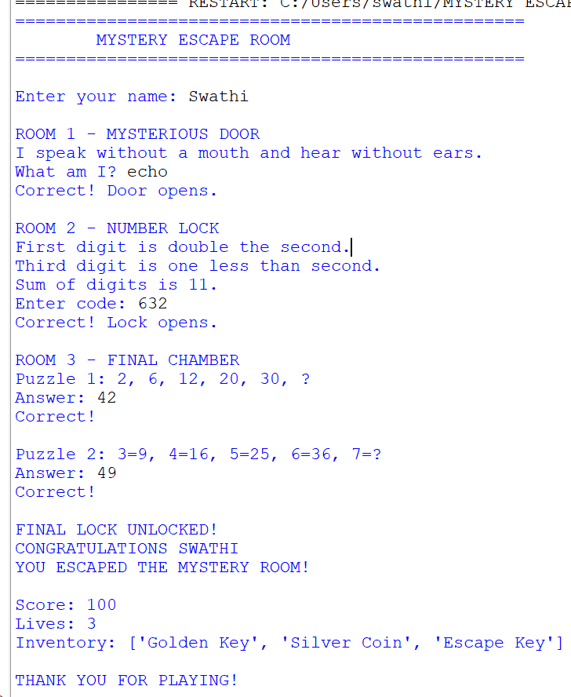

# 🗝️ Mystery Escape Room

## Project Overview

Mystery Escape Room is a console-based Python game where the player solves different puzzles to escape from a mysterious room.

## Features

- Player name input
- Multiple rooms
- Riddle-based puzzle
- Number lock puzzle
- Number sequence puzzles
- Score calculation
- Life tracking
- Inventory management
- Final escape result

## Python Concepts Used

- Variables
- Input and Output
- Conditional Statements
- if-else
- Lists
- `append()`
- Arithmetic Operators
- Comparison Operators
- String Methods

## Game Structure

### Room 1 - Mysterious Door
The player solves a riddle to open the door.

### Room 2 - Number Lock
The player solves a three-digit number puzzle.

### Room 3 - Final Chamber
The player solves two number sequence puzzles.

## Scoring

- Room 1: 20 points
- Room 2: 30 points
- Puzzle 1: 25 points
- Puzzle 2: 25 points

**Maximum Score: 100**

## Sample Output

The player successfully solves all the puzzles and escapes the mystery room.

## Project Screenshot

## Technologies Used

- Python
- Python IDE

## Conclusion

This project helped me practice Python programming fundamentals, conditional statements, lists, operators, and logical problem-solving through an interactive puzzle game.
